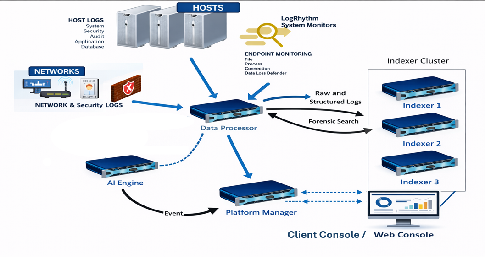

<div align="center">

# 🛡️ LogRhythm SIEM — Enterprise Deployment & Administration Lab

**Secure · Detect · Respond · Monitor**

[](https://logrhythm.com)
[](https://grafana.com)
[](https://docs.microsoft.com/en-us/powershell/)
[](https://attack.mitre.org)
[](https://www.microsoft.com/en-us/windows-server)

---

*Internship project at* **DATAPROTECT, Casablanca** — *February to April 2026*
*Supervisor: M. Modibo MALLÉ*

</div>

---

## 📖 About

This repository documents a complete, hands-on deployment of a **LogRhythm SIEM** platform — from bare-metal installation through custom log ingestion, AI Engine alarm creation, File Integrity Monitoring (FIM), and full platform health observability via Grafana.

The project covers the full SIEM lifecycle:
- Multi-component platform installation and configuration
- Custom log source integration in CSV and JSON formats with MPE parsing rules
- AI Engine detection rules mapped to MITRE ATT&CK techniques
- File Integrity Monitoring for add / modify / delete events
- PowerShell scripts to simulate realistic security events for end-to-end testing
- Platform health monitoring via Grafana dashboards

---

## 🏗️ Architecture

### LogRhythm Platform — Official Architecture

The diagram below shows the standard LogRhythm SIEM component topology and data flow, as deployed in this project:

<div align="center">



</div>

| Component | Role |
|---|---|
| **Hosts / Networks** | Log sources — system, security, audit, application, network & firewall logs |
| **System Monitors** | Endpoint agents for file, process, connection, and DLP monitoring |
| **Data Processor** | Central ingestion hub — normalizes raw logs to structured CEF format |
| **AI Engine** | Correlates events and fires alarms based on detection rules |
| **Platform Manager** | Management console — RBAC, deployment, Web Console access |
| **Indexer Cluster** | Stores raw and structured logs, enables forensic search |
| **Client / Web Console** | SOC analyst interface — alarm triage, log search, case management |

---

### Lab-Specific Architecture — What We Built

The diagram below maps the exact topology of this lab to the official architecture above — showing both machines, custom log sources, PowerShell simulation scripts, and each detection rule with its MITRE technique:

<div align="center">

<svg width="100%" viewBox="0 0 680 620" role="img" xmlns="http://www.w3.org/2000/svg">
<title>LogRhythm Lab — Architecture spécifique</title>
<desc>Diagramme de l'architecture du lab LogRhythm SIEM montrant la machine cible et la plateforme LogRhythm avec les flux de données.</desc>
<defs>
  <marker id="arrow" viewBox="0 0 10 10" refX="8" refY="5" markerWidth="6" markerHeight="6" orient="auto-start-reverse">
    <path d="M2 1L8 5L2 9" fill="none" stroke="context-stroke" stroke-width="1.5" stroke-linecap="round" stroke-linejoin="round"/>
  </marker>
</defs>

<!-- TARGET MACHINE -->
<rect x="18" y="12" width="644" height="128" rx="10" fill="#1a2a3a" stroke="#4A90D9" stroke-width="1.5" stroke-dasharray="5 3"/>
<text x="30" y="30" font-family="sans-serif" font-size="11" font-weight="600" fill="#4A90D9">🖥  Target Machine — Monitored Endpoint</text>

<rect x="32" y="40" width="148" height="88" rx="7" fill="#0f1e2e" stroke="#4A90D9" stroke-width="1"/>
<text x="106" y="62" text-anchor="middle" font-family="sans-serif" font-size="11" font-weight="600" fill="#B5D4F4">Auth Logs · CSV</text>
<text x="106" y="79" text-anchor="middle" font-family="sans-serif" font-size="9.5" fill="#7aaacc">Generate-EnrichedAuth</text>
<text x="106" y="92" text-anchor="middle" font-family="sans-serif" font-size="9.5" fill="#7aaacc">Logs.ps1</text>
<text x="106" y="110" text-anchor="middle" font-family="sans-serif" font-size="9" fill="#4A90D9">log ingestion ↓</text>

<rect x="266" y="40" width="148" height="88" rx="7" fill="#0f1e2e" stroke="#4A90D9" stroke-width="1"/>
<text x="340" y="62" text-anchor="middle" font-family="sans-serif" font-size="11" font-weight="600" fill="#B5D4F4">Firewall Logs · JSON</text>
<text x="340" y="79" text-anchor="middle" font-family="sans-serif" font-size="9.5" fill="#7aaacc">Generate-FirewallLogs</text>
<text x="340" y="92" text-anchor="middle" font-family="sans-serif" font-size="9.5" fill="#7aaacc">-JSON.ps1</text>
<text x="340" y="110" text-anchor="middle" font-family="sans-serif" font-size="9" fill="#4A90D9">log ingestion ↓</text>

<rect x="500" y="40" width="148" height="88" rx="7" fill="#0f1e2e" stroke="#4A90D9" stroke-width="1"/>
<text x="574" y="60" text-anchor="middle" font-family="sans-serif" font-size="11" font-weight="600" fill="#B5D4F4">System Monitor Agent</text>
<text x="574" y="77" text-anchor="middle" font-family="sans-serif" font-size="9.5" fill="#7aaacc">FIM: C:\FIM_TEST\</text>
<text x="574" y="94" text-anchor="middle" font-family="sans-serif" font-size="9.5" fill="#7aaacc">Generate-FIM-Activity</text>
<text x="574" y="107" text-anchor="middle" font-family="sans-serif" font-size="9.5" fill="#7aaacc">.ps1</text>

<!-- LOGRHYTHM PLATFORM -->
<rect x="18" y="170" width="644" height="420" rx="10" fill="#111b26" stroke="#2a5580" stroke-width="1.5" stroke-dasharray="5 3"/>
<text x="30" y="190" font-family="sans-serif" font-size="11" font-weight="600" fill="#4A90D9">⚙  LogRhythm Platform — LR-XMVS_MACHINE</text>

<rect x="252" y="202" width="176" height="60" rx="7" fill="#183050" stroke="#4A90D9" stroke-width="1.2"/>
<text x="340" y="225" text-anchor="middle" font-family="sans-serif" font-size="12" font-weight="700" fill="#e8f4ff">Data Processor</text>
<text x="340" y="243" text-anchor="middle" font-family="sans-serif" font-size="9.5" fill="#7aaacc">MPE · CEF Normalization</text>

<rect x="32" y="310" width="152" height="56" rx="7" fill="#183050" stroke="#4A90D9" stroke-width="1"/>
<text x="108" y="333" text-anchor="middle" font-family="sans-serif" font-size="11" font-weight="600" fill="#e8f4ff">Platform Manager</text>
<text x="108" y="350" text-anchor="middle" font-family="sans-serif" font-size="9.5" fill="#7aaacc">RBAC · Web Console</text>

<rect x="200" y="310" width="152" height="56" rx="7" fill="#183050" stroke="#4A90D9" stroke-width="1"/>
<text x="276" y="333" text-anchor="middle" font-family="sans-serif" font-size="11" font-weight="600" fill="#e8f4ff">Data Indexer</text>
<text x="276" y="350" text-anchor="middle" font-family="sans-serif" font-size="9.5" fill="#7aaacc">Storage · Search</text>

<rect x="370" y="310" width="152" height="56" rx="7" fill="#183050" stroke="#4A90D9" stroke-width="1.2"/>
<text x="446" y="333" text-anchor="middle" font-family="sans-serif" font-size="11" font-weight="600" fill="#e8f4ff">AI Engine</text>
<text x="446" y="350" text-anchor="middle" font-family="sans-serif" font-size="9.5" fill="#7aaacc">Correlation · Detection</text>

<rect x="526" y="202" width="124" height="155" rx="7" fill="#0d1e30" stroke="#2a6090" stroke-width="1" stroke-dasharray="4 2"/>
<text x="588" y="220" text-anchor="middle" font-family="sans-serif" font-size="9.5" font-weight="600" fill="#6aaad4">Custom Log Sources</text>

<rect x="534" y="228" width="108" height="48" rx="5" fill="#162840" stroke="#2a6090" stroke-width="0.8"/>
<text x="588" y="245" text-anchor="middle" font-family="sans-serif" font-size="9.5" font-weight="600" fill="#B5D4F4">CSV Log Source</text>
<text x="588" y="260" text-anchor="middle" font-family="sans-serif" font-size="8.5" fill="#5a8caa">Auth events · mapping</text>

<rect x="534" y="292" width="108" height="48" rx="5" fill="#162840" stroke="#2a6090" stroke-width="0.8"/>
<text x="588" y="309" text-anchor="middle" font-family="sans-serif" font-size="9.5" font-weight="600" fill="#B5D4F4">JSON Log Source</text>
<text x="588" y="324" text-anchor="middle" font-family="sans-serif" font-size="8.5" fill="#5a8caa">Firewall events · mapping</text>

<!-- AI ENGINE ALARMS -->
<rect x="32" y="400" width="220" height="148" rx="7" fill="#1a1010" stroke="#c0392b" stroke-width="1" stroke-dasharray="4 2"/>
<text x="142" y="418" text-anchor="middle" font-family="sans-serif" font-size="9.5" font-weight="600" fill="#e74c3c">AI Engine Alarms</text>

<rect x="42" y="426" width="200" height="50" rx="5" fill="#2c1010" stroke="#c0392b" stroke-width="0.8"/>
<text x="52" y="444" font-family="sans-serif" font-size="9.5" font-weight="600" fill="#ff6b5b">🔴 Brute Force — T1110</text>
<text x="52" y="459" font-family="sans-serif" font-size="8.5" fill="#cc7777">≥5 failed logins / 10 min</text>

<rect x="42" y="488" width="200" height="50" rx="5" fill="#2c1c10" stroke="#e67e22" stroke-width="0.8"/>
<text x="52" y="506" font-family="sans-serif" font-size="9.5" font-weight="600" fill="#f39c12">🟠 After-Hours — T1005</text>
<text x="52" y="521" font-family="sans-serif" font-size="8.5" fill="#cc9955">time-based correlation filter</text>

<!-- FIM ALARMS -->
<rect x="270" y="400" width="220" height="148" rx="7" fill="#0f1e10" stroke="#27ae60" stroke-width="1" stroke-dasharray="4 2"/>
<text x="380" y="418" text-anchor="middle" font-family="sans-serif" font-size="9.5" font-weight="600" fill="#27ae60">FIM Alarms — T1565</text>

<rect x="280" y="426" width="200" height="32" rx="5" fill="#152015" stroke="#27ae60" stroke-width="0.7"/>
<text x="380" y="447" text-anchor="middle" font-family="sans-serif" font-size="9.5" fill="#58d68d">📁 File Added</text>

<rect x="280" y="466" width="200" height="32" rx="5" fill="#152015" stroke="#f39c12" stroke-width="0.7"/>
<text x="380" y="487" text-anchor="middle" font-family="sans-serif" font-size="9.5" fill="#f5cba7">✏ File Modified</text>

<rect x="280" y="506" width="200" height="32" rx="5" fill="#152015" stroke="#e74c3c" stroke-width="0.7"/>
<text x="380" y="527" text-anchor="middle" font-family="sans-serif" font-size="9.5" fill="#f1948a">🗑 File Deleted</text>

<!-- GRAFANA -->
<rect x="508" y="400" width="142" height="148" rx="7" fill="#1c1400" stroke="#e67e22" stroke-width="1.2"/>
<text x="579" y="426" text-anchor="middle" font-family="sans-serif" font-size="11" font-weight="700" fill="#f39c12">📊 Grafana</text>
<text x="579" y="444" text-anchor="middle" font-family="sans-serif" font-size="9" fill="#cc9955">Platform Health</text>
<text x="579" y="460" text-anchor="middle" font-family="sans-serif" font-size="9" fill="#cc9955">EPS · Component Status</text>
<text x="579" y="476" text-anchor="middle" font-family="sans-serif" font-size="9" fill="#cc9955">Alarm Rate</text>

<!-- ARROWS -->
<line x1="106" y1="128" x2="106" y2="160" stroke="#4A90D9" stroke-width="1.2" marker-end="url(#arrow)"/>
<line x1="106" y1="160" x2="310" y2="202" stroke="#4A90D9" stroke-width="1.2" marker-end="url(#arrow)"/>
<line x1="340" y1="128" x2="340" y2="202" stroke="#4A90D9" stroke-width="1.2" marker-end="url(#arrow)"/>
<line x1="574" y1="128" x2="574" y2="158" stroke="#27ae60" stroke-width="1.2"/>
<line x1="574" y1="158" x2="446" y2="310" stroke="#27ae60" stroke-width="1.2" marker-end="url(#arrow)"/>
<line x1="290" y1="262" x2="180" y2="310" stroke="#4A90D9" stroke-width="1" marker-end="url(#arrow)"/>
<line x1="320" y1="262" x2="310" y2="310" stroke="#4A90D9" stroke-width="1" marker-end="url(#arrow)"/>
<line x1="390" y1="262" x2="430" y2="310" stroke="#4A90D9" stroke-width="1" marker-end="url(#arrow)"/>
<line x1="428" y1="232" x2="534" y2="252" stroke="#2a6090" stroke-width="1" stroke-dasharray="4 2" marker-end="url(#arrow)"/>
<line x1="428" y1="240" x2="534" y2="316" stroke="#2a6090" stroke-width="1" stroke-dasharray="4 2" marker-end="url(#arrow)"/>
<line x1="420" y1="366" x2="240" y2="400" stroke="#c0392b" stroke-width="1" stroke-dasharray="4 2" marker-end="url(#arrow)"/>
<line x1="446" y1="366" x2="446" y2="400" stroke="#27ae60" stroke-width="1" stroke-dasharray="4 2" marker-end="url(#arrow)"/>
<line x1="560" y1="350" x2="560" y2="400" stroke="#e67e22" stroke-width="1" stroke-dasharray="4 2" marker-end="url(#arrow)"/>

<!-- FIM events label -->
<rect x="490" y="145" width="66" height="16" rx="3" fill="#111b26"/>
<text x="523" y="156" text-anchor="middle" font-family="sans-serif" font-size="8.5" fill="#58d68d">FIM events</text>

</svg>

</div>
---

## 📋 Table of Contents

1. [Phase 1 — Installation & Initial Setup](#phase-1--installation--initial-setup)
2. [Phase 2 — Component Configuration](#phase-2--component-configuration)
3. [Phase 3 — Custom Log Sources](#phase-3--custom-log-sources)
4. [Phase 4 — AI Engine Alarms](#phase-4--ai-engine-alarms)
5. [Phase 5 — File Integrity Monitoring](#phase-5--file-integrity-monitoring-fim)
6. [Phase 6 — Platform Health & Grafana](#phase-6--platform-health--grafana-observability)
7. [Log Generation Scripts](#log-generation-scripts)
8. [Key Takeaways](#key-takeaways)

---

## Phase 1 — Installation & Initial Setup

### Components Installed

| Component | Role |
|---|---|
| Platform Manager | Central management console & web UI |
| Data Processor | Log ingestion & MPE normalization engine |
| AI Engine | Real-time correlation & detection |
| System Monitor | Health monitoring & FIM agent |
| Data Indexer | Log storage & search |

### Key Technical Challenges

- **Resource planning** — High CPU/RAM demands required upfront capacity modeling
- **Inter-component networking** — Configuring secure channels between Platform Manager, Data Processor, and AI Engine
- **Certificate management** — Setting up SSL/TLS for all component communications
- **Dependency resolution** — Handling prerequisite software and version compatibility

### Screenshots

> 📸 `screenshots/01-installation/`
>
> | File | Content |
> |---|---|
> | `01_platform_manager_install.png` | Platform Manager installer / initial boot |
> | `02_data_processor_install.png` | Data Processor setup |
> | `03_ai_engine_install.png` | AI Engine installation |
> | `04_system_monitor_install.png` | System Monitor agent setup |
> | `05_services_running.png` | All services confirmed running |
> | `06_web_console_login.png` | First successful login to the Web Console |

---

## Phase 2 — Component Configuration

After installation, each component was configured and integrated:

- **Platform Manager** — Configured entity hierarchy, user roles (RBAC), and deployment policies
- **Data Processor** — Set log ingestion pipelines and retention policies
- **AI Engine** — Linked to Data Processor for real-time event correlation
- **System Monitor** — Deployed to `TARGET_MACHINE` for health checks and FIM

### Screenshots

> 📸 `screenshots/02-configuration/`
>
> | File | Content |
> |---|---|
> | `01_platform_manager_dashboard.png` | Platform Manager home / deployment manager |
> | `02_entity_structure.png` | Entity/site hierarchy |
> | `03_data_processor_config.png` | Data Processor pipeline settings |
> | `04_ai_engine_config.png` | AI Engine configuration panel |
> | `05_system_monitor_agent.png` | Agent connected on TARGET_MACHINE |
> | `06_rbac_roles.png` | User roles and permissions |

---

## Phase 3 — Custom Log Sources

Two custom log source types were created in the Deployment Manager, each with tailored **MPE (Message Processing Engine)** parsing rules to extract fields and normalize to LogRhythm's Common Event Format (CEF).

---

### 3.1 Auth Logs — CSV Format

**File:** `C:\LogRhythmLogs\auth_logs.csv` | **Script:** `Generate-EnrichedAuthLogs.ps1`

```csv
timestamp,source_ip,username,event_type,status,hostname
2026-04-23T10:26:00,192.168.1.50,jdoe,SSH_LOGIN,FAILED,TARGET_MACHINE
```

**MPE rule highlights:**
- Delimiter: comma (`,`)
- Fields extracted: `timestamp`, `source_ip`, `username`, `event_type`, `status`
- Classification: **Authentication → Failed Login**

### 3.2 Firewall Logs — JSON Format

**File:** `C:\LogRhythmLogs\firewall_logs.json` | **Script:** `Generate-FirewallLogs-JSON-FIXED.ps1`

```json
{
  "timestamp": "2026-04-20T15:50:00Z",
  "src_ip": "10.0.0.5",
  "dst_ip": "8.8.8.8",
  "action": "DENY",
  "protocol": "TCP",
  "dst_port": 443
}
```

**MPE rule highlights:**
- Format: JSON key-value extraction
- Fields: `timestamp`, `src_ip`, `dst_ip`, `action`, `protocol`, `dst_port`
- Classification: **Network → Firewall Activity**

### Screenshots

> 📸 `screenshots/03-log-sources/`
>
> | File | Content |
> |---|---|
> | `csv/01_log_source_type_csv.png` | CSV Log Source Type definition |
> | `csv/02_mpe_rule_csv.png` | MPE Rule editor — CSV parsing |
> | `csv/03_field_mapping_csv.png` | Field mapping to CEF |
> | `csv/04_parsed_events_csv.png` | Parsed auth events in Log Search |
> | `json/01_log_source_type_json.png` | JSON Log Source Type definition |
> | `json/02_mpe_rule_json.png` | MPE Rule editor — JSON parsing |
> | `json/03_parsed_events_json.png` | Firewall events in Log Search |
> | `scripts_folder.png` | All scripts in `C:\LogRhythmLogs\` |

---

## Phase 4 — AI Engine Alarms

Two detection rules were built in the AI Engine, mapped to the **MITRE ATT&CK** framework.

---

### 🔴 Alarm 1 — Brute Force Detection

| Parameter | Value |
|---|---|
| Trigger | ≥ 5 failed auth events from same source IP within 10 min |
| Log Sources | `auth_logs.csv` |
| MITRE ATT&CK | [T1110 — Brute Force](https://attack.mitre.org/techniques/T1110/) |
| Priority | High |
| Risk Rating | 75 / 100 |
| Response | Email to SOC · Auto-case creation |

**Rule logic:**
1. Filter: `event_type = FAILED_LOGIN`
2. Aggregate by `source_ip`
3. Count within a 10-minute sliding window
4. Fire alarm when count ≥ 5

### 🟠 Alarm 2 — After-Hours File Access

| Parameter | Value |
|---|---|
| Trigger | Sensitive file access outside 08:00–18:00 |
| Log Sources | FIM events + file access logs |
| MITRE ATT&CK | [T1005 — Data from Local System](https://attack.mitre.org/techniques/T1005/) |
| Priority | Medium-High |
| Risk Rating | 65 / 100 |
| Response | Email notification · Audit log entry |

### Screenshots

> 📸 `screenshots/04-alarms/`
>
> | File | Content |
> |---|---|
> | `brute-force/01_aie_rule_editor.png` | AI Engine rule editor — brute force |
> | `brute-force/02_threshold_config.png` | Threshold and time-window settings |
> | `brute-force/03_alarm_triggered.png` | Alarm in Alarm Manager |
> | `brute-force/04_case_created.png` | Auto-created investigation case |
> | `after-hours/01_aie_rule_time_filter.png` | Time-based filter configuration |
> | `after-hours/02_alarm_triggered.png` | After-hours alarm fired |

---

## Phase 5 — File Integrity Monitoring (FIM)

FIM was configured to detect unauthorized changes inside a monitored directory on `TARGET_MACHINE`. Any file or folder change triggers an alarm in the AI Engine.

### Monitored Path

```
C:\FIM_TEST\
```

### Detection Coverage

| Change Type | Alarm |
|---|---|
| File / folder **added** | ✅ Triggered |
| File / folder **modified** | ✅ Triggered |
| File / folder **deleted** | ✅ Triggered |

### Technical Challenges Solved

- **Case sensitivity** — LogRhythm FIM path filters are case-sensitive; resolved by testing both casing variants
- **AND/OR logic in Rule Blocks** — Mastered filter logic to match add/modify/delete events independently
- **Regex path matching** — Developed patterns for flexible directory matching (e.g., `C:\\FIM_TEST\\.*`)
- **Baseline management** — Documented initial file states before enabling live monitoring

### Screenshots

> 📸 `screenshots/05-fim/`
>
> | File | Content |
> |---|---|
> | `01_fim_policy.png` | FIM policy — monitored path setup |
> | `02_rule_block_add.png` | Rule Block for ADD events |
> | `03_rule_block_modify.png` | Rule Block for MODIFY events |
> | `04_rule_block_delete.png` | Rule Block for DELETE events |
> | `05_fim_alarm_add.png` | FIM alarm — file created in `C:\FIM_TEST\` |
> | `06_fim_alarm_modify.png` | FIM alarm — file modified |
> | `07_fim_alarm_delete.png` | FIM alarm — file deleted |
> | `08_fim_test_folder.png` | `FIM_TEST` folder in Explorer sidebar |

---

## Phase 6 — Platform Health & Grafana Observability

Platform health was monitored through LogRhythm's built-in health views and a **Grafana** dashboard connected to platform metrics.

### Health Checks Performed

- **System Monitor** — Component status across all platform nodes
- **Data Processor** — Events per second (EPS) throughput and queue depth
- **AI Engine** — Processing latency and rule evaluation rate
- **Data Indexer** — Storage utilization and index health
- **Log Sources** — Connectivity status for all custom sources

### Screenshots

> 📸 `screenshots/06-health-grafana/`
>
> | File | Content |
> |---|---|
> | `01_system_monitor_health.png` | System Monitor component health |
> | `02_data_processor_eps.png` | Events per second throughput |
> | `03_ai_engine_status.png` | AI Engine processing status |
> | `04_grafana_overview.png` | Grafana main dashboard |
> | `05_grafana_log_volume.png` | Log ingestion volume over time |
> | `06_grafana_alarm_rate.png` | Alarm firing rate panel |

---

## Log Generation Scripts

All scripts live in `C:\LogRhythmLogs\` on `TARGET_MACHINE` and simulate realistic security events for end-to-end testing.

| Script | Purpose |
|---|---|
| `Generate-EnrichedAuthLogs.ps1` | Generates CSV auth logs — failed/success logins, IPs, users |
| `Generate-FirewallLogs-JSON.ps1` | Generates JSON firewall allow/deny events |
| `Generate-FirewallLogs-JSON-FIXED.ps1` | Fixed version with corrected timestamp formatting |
| `Generate-FIM-Activity.ps1` | Simulates file add/modify/delete in `C:\FIM_TEST\` |
| `Test-LogRhythmAlarms.ps1` | End-to-end test targeting both AI Engine alarms |
| `Lancer-GenerateurLogs-Enrichi.bat` | Batch launcher — quick-start wrapper |

---

## Key Takeaways

### Security Use Cases Demonstrated

| Use Case | Detection Method | MITRE ATT&CK |
|---|---|---|
| Brute force / credential stuffing | Threshold correlation on auth failures | [T1110](https://attack.mitre.org/techniques/T1110/) |
| After-hours data access | Time-based AI Engine rule | [T1005](https://attack.mitre.org/techniques/T1005/) |
| Unauthorized file system changes | FIM agent + AI Engine alarm | [T1565](https://attack.mitre.org/techniques/T1565/) |

### Lessons Learned

- **MPE Rules** are the backbone of LogRhythm's power — getting parsing right for non-standard formats (especially JSON) requires iterative testing
- **AI Engine rule logic** is nuanced: block ordering and AND/OR conditions significantly affect detection accuracy
- **FIM is sensitive to path casing and regex escaping** — small mistakes lead to silent failures
- **Grafana integration** transforms raw component metrics into operational insight

---

## 📁 Repository Structure

```
LogRhythm-SIEM-Lab/
├── README.md
├── scripts/
│   ├── Generate-EnrichedAuthLogs.ps1
│   ├── Generate-FirewallLogs-JSON-FIXED.ps1
│   ├── Generate-FIM-Activity.ps1
│   ├── Test-LogRhythmAlarms.ps1
│   └── Lancer-GenerateurLogs-Enrichi.bat
├── sample-logs/
│   ├── auth_logs_enriched_example.csv
│   └── firewall_logs_sample.json
├── config/
│   ├── Configuration_LogRhythm_CSV_Enrichi.txt
│   └── Configuration_CSV_Enrichi_LogRhythm.docx
└── screenshots/
    ├── architecture/
    │   └── logrhythm_architecture.png
    ├── 01-installation/
    ├── 02-configuration/
    ├── 03-log-sources/
    │   ├── csv/
    │   └── json/
    ├── 04-alarms/
    │   ├── brute-force/
    │   └── after-hours/
    ├── 05-fim/
    └── 06-health-grafana/
```

---

## 🔗 Connect

[](https://linkedin.com/in/tjodansoko)
[](https://github.com/mahamadoudansoko)

---

<div align="center">
<i>"Security and automation go hand in hand — a connected world must also be a protected and resilient one."</i><br>
— Mahamadou Dansoko
</div>